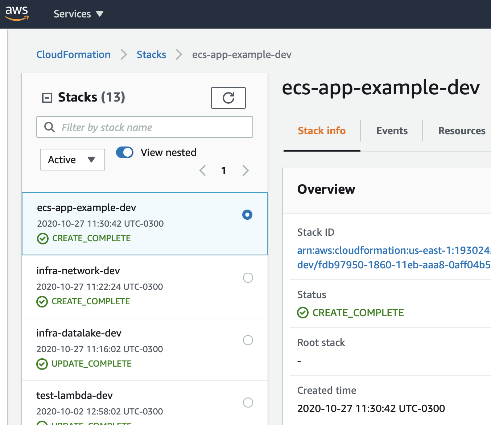
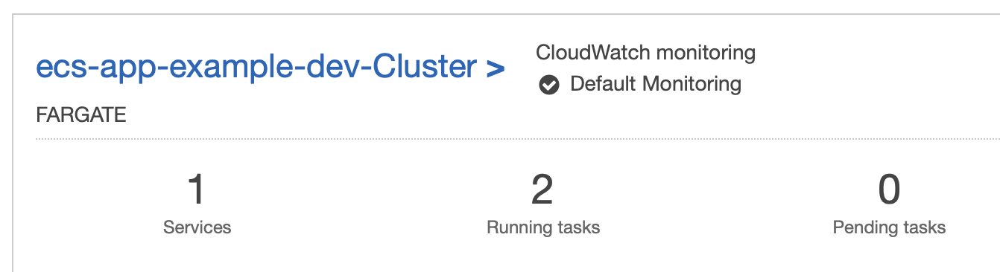
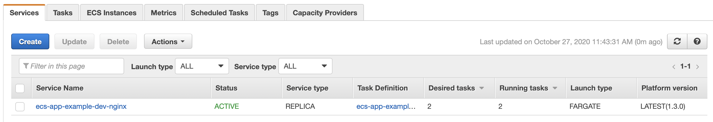
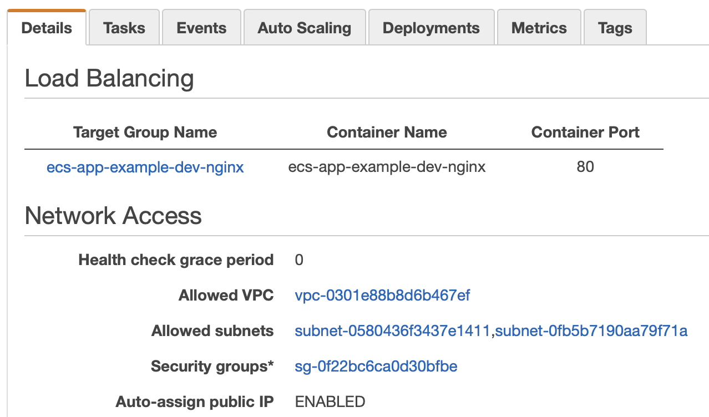
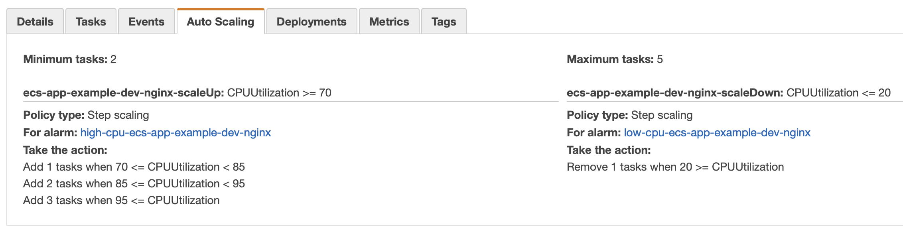
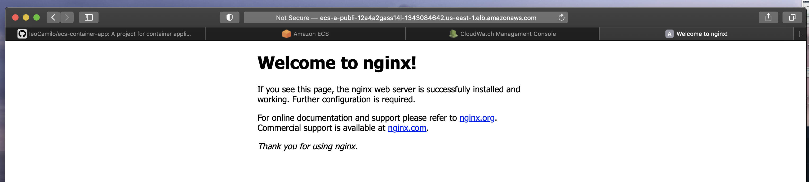
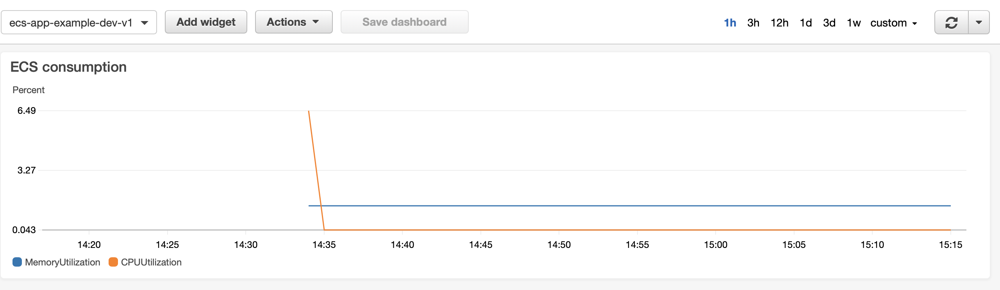

# ecs-container-app

This project is focused in create a application platform at cloud for container deployment and auto management using IaaC and serverless framework in AWS


### Getting Started
---

This project is splited into 3 parts
- datalake: *this creates yout deployment bucket that can be used to all your future serverless projects*

- network: *creates all the network configuration needed for the example like vpc, security groups and subnets, also usable for future, core resources like those should be deployed separately for security (they are less updated also)*

- ecs-app: *the container plataform deployed with load-balacing, auto-scale, recovery and all features desired*


### Deploy
---

By default every project is deployed as dev stage, another **important** step is change the bucket name over `datalake/resources/s3.yml` file since the names over s3 service are global and can not repeat.

To deploy the project you need an AWS account and an CLI environment configured with [AWS-CLI](https://aws.amazon.com/cli/) and [Serverless](https://www.serverless.com/framework/docs/getting-started#via-npm) configured, execute `aws configure` to verify your credentials.


command sequence:

1. `cd datalake && serverless deploy && cd ..`
2. `cd network && serverless deploy && cd ..`
3. `cd ecs-app && serverless deploy && cd ..`

### Result
---

After the deploy if everything goes as planed, at the AWS console, on Cloudformation, should have 3 stacks:

- infra-datalake-dev
- infra-network-dev
- ecs-app-example-dev



This will create a cluster over ecs:



With a nginx service:



This service will have a load balancer attached, and all network configuration set:



And an auto-scale rule base on CPU utilization:



Using the load-balancer url is possible to access the nginx service:




### Info
---

At the `ecs-app/stage-variables/dev.yml` file you can set the configurations for your services, setup more then one service or image, and create different configurations for each stage:

```yaml
ecs:
  exampleService:
    serviceName: ${self:custom.stackName}-nginx
    port: 80          # What port number the application inside the docker container is binding to
    cpu: 256          # How much CPU to give the container. 1024 is 1 CPU
    memory: 512       # How much memory in megabytes to give the container
    desiredCount: 2   # How many copies of the service task to run
    priority: 1       # The priority for the routing rule added to the load balancer. This only applies if your have multiple services which have been assigned to different paths on the load balancer.
    imageUrl: nginx   # The url of a docker image that contains the application process that will handle the traffic for this service
    path: '*'         # A path on the public load balancer that this service should be connected to. Use * to send all load balancer traffic to this service.

```

### Monitoring
---

The project also contains a custom built in CloudWatch monitoring system for resources consumption visualization and alarm system:



This can be improved to add any information needed.